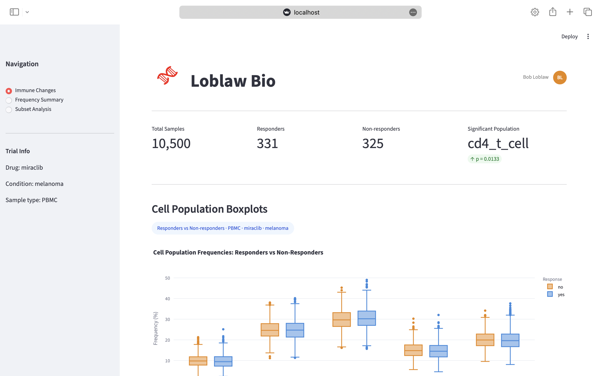

# 🧬 TeikoLab


Built for Bob Loblaw at Loblaw Bio to analyze immune cell data from an ongoing clinical trial for his drug candidate miraclib.



## Overview

Bob Loblaw is a drug developer at Loblaw Bio running a clinical trial for his drug candidate miraclib on melanoma patients. He needed a way to analyze how the drug affects immune cell populations across patients who respond to treatment versus those who don't.

This platform takes raw cytometry data from the trial, loads it into a structured SQLite database, runs statistical analysis to find patterns, and displays everything in an interactive dashboard Bob can explore directly. 

The analysis found that cd4_t_cell frequencies are significantly different between responders and non-responders (p = 0.0133, Mann-Whitney U test), making it a potential biomarker for predicting miraclib response in melanoma patients.

## File Structure

```
TeikoLab/
├── load_data.py       # initializes the SQLite database & loads cell-count.csv 
├── summary.py         # computes the relative frequency of each cell population per sample
├── stat_analysis.py   # compares responders vs. non-responders & runs the stats test
├── subset.py          # queries the database for baseline melanoma miraclib PBMC samples
├── dashboard.py       # the interactive dashboard Bob uses to explore the data
├── cell-count.csv     # the raw clinical trial data
├── cell-count.db      # the SQLite database built from cell-count.csv
├── boxplot.png        # the boxplot saved from the statistical analysis
├── requirements.txt   # all the Python packages needed to run this project
├── Makefile           # three commands to set up, run, & launch the dashboard
└── README.md          # this file (you are here!)
```

## How to Run

### Option 1: Run locally

Clone the repo and run the following three commands in order:

```bash
make setup
```
Installs all dependencies from requirements.txt.

```bash
make pipeline
```
Loads the data, initializes the database, runs the frequency analysis, statistical analysis, and subset queries. All output files are generated automatically.

```bash
make dashboard
```
Starts the Streamlit dashboard locally. Open your browser and go to `http://localhost:8501`

> Tested on Python 3.13. Designed to run in GitHub Codespaces or any Mac/Linux environment.

---

### Option 2: Run with Docker

> Make sure Docker Desktop is installed and running before executing these commands.

```bash
docker build -t teikolab .
docker run -p 8501:8501 teikolab
```

Open your browser and go to `http://localhost:8501`

> No need to install Python or any dependencies manually, Docker handles everything :D

## Schema

The data is split into two tables: `subjects` and `samples`.

`subjects` stores everything about the patient that stays the same across visits such as project, condition, age, sex, treatment, and response. Each patient has one row.

`samples` stores the actual cell counts per visit such as sample ID, sample type, timepoint, and the five cell population counts. Each sample links back to its patient via a foreign key on `subject`.

The reason for splitting them is to avoid repeating patient info on every row. A patient has 3 samples (timepoints 0, 7, 14), so without the split you'd store their age, sex, condition, and treatment 3 times per patient. With the split, that info lives once in `subjects` and the samples just reference it.

**How it scales:**

If you had hundreds of projects and thousands of samples, this design holds up well. Adding a new project is just new rows, not new tables. If you wanted to add new analytics like tracking additional cell populations or new metadata fields, you'd just add columns. For very large datasets you'd add indexes on commonly queried columns like `condition`, `treatment`, and `time_from_treatment_start` to keep queries fast.

## Dashboard

The dashboard is built with Streamlit and connects directly to the SQLite database. It has three pages:

**Immune Changes** shows the boxplot comparing responders vs non-responders across all five cell populations. The chart is interactive, you can zoom, pan, and hover to see exact values. cd4_t_cell is the only statistically significant population (p = 0.0133).

**Frequency Summary** shows a filterable table of relative cell population frequencies. Bob can filter by condition, treatment, and timepoint and the table updates live.

**Subset Analysis** shows baseline stats for melanoma miraclib PBMC patients at time=0, samples per project, responders vs non-responders, males vs females, and average B cell count. There is also a custom query section where Bob can select any cell population, sex, and timepoint and get the average count back instantly.

To launch the dashboard run `make dashboard` or with Docker run `docker run -p 8501:8501 teikolab`. Then open `http://localhost:8501`.

## Code Structure

The project is split into four separate scripts that each handle one part of the pipeline, plus the dashboard.

`load_data.py` runs first and only needs to run once. It sets up the database and loads the CSV. Keeping it separate means you don't reload the data every time you run the analysis.

`summary.py` handles the frequency calculations. `stat_analysis.py` handles the statistics and boxplot. `subset.py` handles the subset queries. Each file does one thing cleanly.

`dashboard.py` is the only file that uses Streamlit. It reads directly from the database and does not depend on the other scripts being imported, which keeps it simple and fast to reload during development.

This separation makes it easy to debug, test, and extend. If Bob wants a new analysis added, you just add a new script and a line to the Makefile.

## References

- Mann, H.B. & Whitney, D.R. (1947). On a Test of Whether One of Two Random Variables is Stochastically Larger than the Other. *Annals of Mathematical Statistics*, 18(1), 50–60.
- Tumeh et al. (2014). PD-1 blockade induces responses by inhibiting adaptive immune resistance. *Nature*, 515, 568–571.